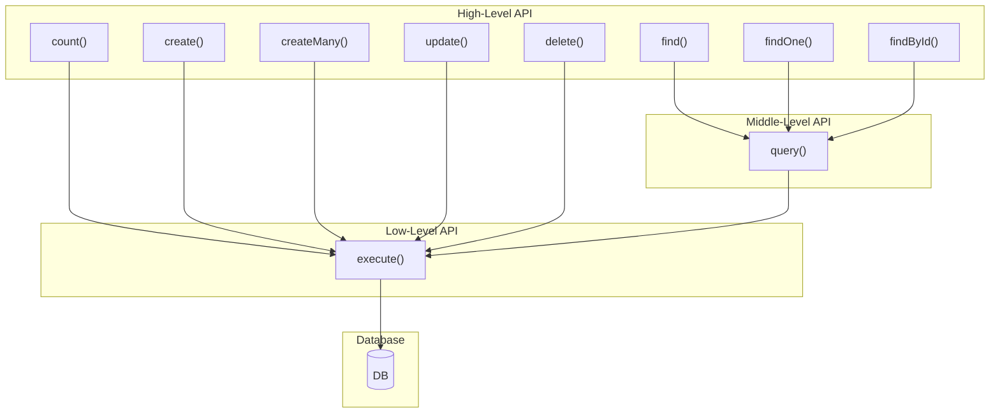

# litedbmodel

A lightweight, SQL-friendly TypeScript ORM for PostgreSQL, MySQL, and SQLite.

[](https://www.npmjs.com/package/litedbmodel)
[](https://opensource.org/licenses/MIT)

## Philosophy

**SQL is not the enemy.** Most ORMs hide SQL behind complex abstractions, making debugging harder and limiting what you can do. litedbmodel takes a different approach:

- **Predictable** — Generated queries are simple, readable, and exactly what you'd write by hand
- **Type-Safe** — Results map to typed model instances with full IDE support
- **Real SQL When Needed** — Complex queries and DB-specific optimizations use actual SQL via `query()`, not a proprietary DSL
- **Model-Centric** — Same model serves list/detail views; relations load on-demand with automatic batch loading

> See [Design Philosophy](./docs/BENCHMARK-NESTED.md#litedbmodels-design-philosophy) for detailed comparison with query-centric ORMs.

## Features

- **Symbol-Based Columns** — `Model.column` enables IDE "Find References" and "Rename Symbol"
- **Type-Safe Conditions** — Compile-time validation with `[Column, value]` tuples
- **Query-Based Models** — Define models backed by complex SQL (aggregations, JOINs, CTEs)
- **Subquery Support** — IN/NOT IN/EXISTS/NOT EXISTS with correlated subqueries
- **Declarative SKIP** — Conditional fields without if-statements
- **Transparent N+1 Prevention** — Batch loading for lazy relations (library's job, not yours)
- **Raw SQL Escape** — `Model.query()` and `DBModel.execute()` when you need full control (DB-specific syntax is your responsibility)
- **Middleware** — Cross-cutting concerns (logging, auth, tenant isolation)
- **Multi-Database** — PostgreSQL, MySQL, SQLite with config-only switching (Tuple API and relations are portable; raw SQL is dialect-dependent)

## Installation

```bash
npm install litedbmodel reflect-metadata

# Plus your database driver:
npm install pg            # PostgreSQL
npm install mysql2        # MySQL
npm install better-sqlite3  # SQLite
```

## Quick Start

```typescript
import 'reflect-metadata';
import { DBModel, model, column, ColumnsOf } from 'litedbmodel';

// 1. Define model
@model('users')
class UserModel extends DBModel {
  @column() id?: number;
  @column() name?: string;
  @column() email?: string;
  @column() is_active?: boolean;
}
export const User = UserModel as typeof UserModel & ColumnsOf<UserModel>;

// 2. Configure database
DBModel.setConfig({
  host: 'localhost',
  database: 'mydb',
  user: 'user',
  password: 'pass',
  // driver: 'mysql',    // for MySQL
  // driver: 'sqlite',   // for SQLite (use database: './data.db')
});

// 3. CRUD operations
const user = await User.create([
  [User.name, 'John'],
  [User.email, 'john@example.com'],
]);

const users = await User.find([[User.is_active, true]]);
const john = await User.findOne([[User.email, 'john@example.com']]);

await User.update([[User.id, 1]], [[User.name, 'Jane']]);
await User.delete([[User.is_active, false]]);
```

---

## Type-Safe Conditions

Conditions use `[Column, value]` tuples for compile-time validation. For operators, use `${Model.column}` in template literals—the ESLint plugin catches incorrect column references.

```typescript
// Equality (compile-time type-safe)
await User.find([[User.status, 'active']]);

// Operators (use ${Model.column} for refactoring safety)
await User.find([[`${User.age} > ?`, 18]]);
await User.find([[`${User.age} BETWEEN ? AND ?`, [18, 65]]]);
await User.find([[`${User.name} LIKE ?`, '%test%']]);
await User.find([[`${User.status} IN (?)`, ['a', 'b']]]);

// NULL checks
await User.find([[`${User.deleted_at} IS NULL`]]);

// OR conditions (type-safe)
await User.find([
  [User.is_active, true],
  User.or(
    [[User.role, 'admin']],
    [[User.role, 'moderator']],
  ),
]);

// ORDER BY
await User.find([[User.is_active, true]], { 
  order: User.created_at.desc() 
});
```

> **ESLint Plugin:** Use `litedbmodel/eslint-plugin` to catch mistakes that TypeScript cannot:
> - Wrong model columns (e.g., `User.find([[Post.id, 1]])`)
> - Hardcoded column names instead of `${Model.column}`
> - Missing `declare` keyword for relation properties

---

## Subquery Conditions

IN/NOT IN and EXISTS/NOT EXISTS subqueries with composite key support.
Key pairs use the same format as relation decorators: `[[parentCol, targetCol], ...]`

```typescript
import { parentRef } from 'litedbmodel';

// IN subquery - key pairs: [[parentCol, targetCol]]
await User.find([
  User.inSubquery([[User.id, Order.user_id]], [
    [Order.status, 'paid']
  ])
]);
// → WHERE users.id IN (SELECT orders.user_id FROM orders WHERE orders.status = 'paid')

// Composite key IN subquery
await User.find([
  User.inSubquery([
    [User.id, Order.user_id],
    [User.group_id, Order.group_id],
  ], [[Order.status, 'active']])
]);
// → WHERE (users.id, users.group_id) IN (SELECT orders.user_id, orders.group_id FROM orders WHERE orders.status = 'active')

// NOT IN subquery
await User.find([
  User.notInSubquery([[User.id, BannedUser.user_id]])
]);
// → WHERE users.id NOT IN (SELECT banned_users.user_id FROM banned_users)

// Correlated subquery with parentRef
await User.find([
  User.inSubquery([[User.id, Order.user_id]], [
    [Order.tenant_id, parentRef(User.tenant_id)],
    [Order.status, 'completed']
  ])
]);
// → WHERE users.id IN (SELECT orders.user_id FROM orders WHERE orders.tenant_id = users.tenant_id AND orders.status = 'completed')

// EXISTS subquery (conditions determine target table)
await User.find([
  [User.is_active, true],
  User.exists([
    [Order.user_id, parentRef(User.id)]
  ])
]);
// → WHERE is_active = TRUE AND EXISTS (SELECT 1 FROM orders WHERE orders.user_id = users.id)

// NOT EXISTS subquery
await User.find([
  User.notExists([
    [Complaint.user_id, parentRef(User.id)]
  ])
]);
// → WHERE NOT EXISTS (SELECT 1 FROM complaints WHERE complaints.user_id = users.id)
```

---

## Declarative SKIP Pattern

Conditional fields without if-statements:

```typescript
import { SKIP } from 'litedbmodel';

// ❌ Imperative
const updates = [];
if (body.name !== undefined) updates.push([User.name, body.name]);
if (body.email !== undefined) updates.push([User.email, body.email]);
await User.update([[User.id, id]], updates);

// ✅ Declarative with SKIP
await User.update([[User.id, id]], [
  [User.name, body.name ?? SKIP],
  [User.email, body.email ?? SKIP],
  [User.updated_at, new Date()],
]);
```

Works for conditions too:

```typescript
await User.find([
  [User.deleted, false],
  [`${User.name} LIKE ?`, query.name ? `%${query.name}%` : SKIP],
  [User.status, query.status ?? SKIP],
]);
```

---

## Column Decorators

### Auto-Inferred Types

```typescript
@column() id?: number;           // Number conversion
@column() name?: string;         // No conversion
@column() is_active?: boolean;   // Boolean conversion
@column() created_at?: Date;     // DateTime conversion
@column() large_id?: bigint;     // BigInt conversion
@column('db_col') prop?: string; // Custom column name
```

### Explicit Types (for arrays/JSON)

```typescript
@column.date() birth_date?: Date;
@column.stringArray() tags?: string[];
@column.intArray() scores?: number[];
@column.json<Settings>() settings?: Settings;
```

---

## Upsert (ON CONFLICT)

```typescript
// Insert or ignore
await User.create(
  [[User.name, 'John'], [User.email, 'john@example.com']],
  { onConflict: User.email, onConflictIgnore: true }
);

// Insert or update
await User.create(
  [[User.name, 'John'], [User.email, 'john@example.com']],
  { onConflict: User.email, onConflictUpdate: [User.name] }
);

// Composite unique key
await UserPref.create(
  [[UserPref.user_id, 1], [UserPref.key, 'theme'], [UserPref.value, 'dark']],
  { onConflict: [UserPref.user_id, UserPref.key], onConflictUpdate: [UserPref.value] }
);
```

---

## Relation Decorators

Define relations declaratively with type-safe decorators:

```typescript
import { DBModel, model, column, hasMany, belongsTo, hasOne, ColumnsOf } from 'litedbmodel';

@model('users')
class UserModel extends DBModel {
  @column() id?: number;
  @column() name?: string;

  // Use 'declare' for relation properties (not '!' assertion)
  // This prevents TypeScript from creating instance properties that shadow the getter
  @hasMany(() => [User.id, Post.author_id])
  declare posts: Promise<Post[]>;

  @hasOne(() => [User.id, UserProfile.user_id])
  declare profile: Promise<UserProfile | null>;
}
export const User = UserModel as typeof UserModel & ColumnsOf<UserModel>;

@model('posts')
class PostModel extends DBModel {
  @column() id?: number;
  @column() author_id?: number;
  @column() title?: string;

  @belongsTo(() => [Post.author_id, User.id])
  declare author: Promise<User | null>;

  @hasMany(() => [Post.id, Comment.post_id])
  declare comments: Promise<Comment[]>;
}
export const Post = PostModel as typeof PostModel & ColumnsOf<PostModel>;

// Usage
const post = await Post.findOne([[Post.id, 1]]);
const author = await post.author;       // Lazy loaded
const comments = await post.comments;   // Lazy loaded
```

> **Important:** Use `declare` (not `!`) for relation properties. TypeScript class field declarations with `!` create instance properties that shadow the prototype getter. The ESLint plugin detects this mistake.

### With Options (order, where)

```typescript
@hasMany(() => [User.id, Post.author_id], {
  order: () => Post.created_at.desc(),
  where: () => [[Post.is_deleted, false]],
})
declare activePosts: Promise<Post[]>;
```

### Composite Key Relations

```typescript
@model('tenant_posts')
class TenantPostModel extends DBModel {
  @column({ primaryKey: true }) tenant_id?: number;
  @column({ primaryKey: true }) id?: number;
  @column() author_id?: number;

  @belongsTo(() => [
    [TenantPost.tenant_id, TenantUser.tenant_id],
    [TenantPost.author_id, TenantUser.id],
  ])
  declare author: Promise<TenantUser | null>;
}
```

### Transparent N+1 Prevention

When `find()` returns multiple records, batch loading is **automatic** — no eager loading specification needed:

```typescript
const users = await User.find([]);  // Auto batch context created

for (const user of users) {
  const posts = await user.posts;   // First access batch loads ALL users' posts
}
// Total: 2 queries instead of N+1!
```

Write natural code (`await user.posts`); litedbmodel handles the optimization.

---

## Transactions

```typescript
// Basic
await DBModel.transaction(async () => {
  const user = await User.findOne([[User.id, 1]]);
  await Account.update([[Account.user_id, user.id]], [[Account.balance, 100]]);
});

// With return value
const user = await DBModel.transaction(async () => {
  return await User.create([[User.name, 'Alice']]);
});

// Auto-retry on deadlock
await DBModel.transaction(
  async () => { /* ... */ },
  { retryOnError: true, retryLimit: 3 }
);

// Preview mode (rollback after execution)
await DBModel.transaction(
  async () => { /* ... */ },
  { rollbackOnly: true }
);
```

---

## Middleware

Class-based middleware for cross-cutting concerns.

### Call Flow

All database operations flow through the middleware system:



**Middleware hooks:**
- **Method-level**: `find`, `findOne`, `findById`, `count`, `create`, `createMany`, `update`, `delete`
- **Instantiation-level**: `query` — returns model instances from raw SQL
- **SQL-level**: `execute` — intercepts ALL SQL queries (SELECT, INSERT, UPDATE, DELETE)

### Example

```typescript
import { Middleware, NextExecute, ExecuteResult } from 'litedbmodel';

class LoggerMiddleware extends Middleware {
  queries: string[] = [];

  async execute(next: NextExecute, sql: string, params?: unknown[]): Promise<ExecuteResult> {
    this.queries.push(sql);
    const start = Date.now();
    const result = await next(sql, params);
    console.log(`${sql} (${Date.now() - start}ms)`);
    return result;
  }
}

DBModel.use(LoggerMiddleware);

// Per-request access
const ctx = LoggerMiddleware.getCurrentContext();
console.log(ctx.queries);
```

### Tenant Isolation Example

```typescript
import { Column } from 'litedbmodel';

class TenantMiddleware extends Middleware {
  tenantId: number = 0;

  async find<T extends typeof DBModel>(model: T, next: NextFind<T>, conditions: Conds) {
    const tenantCol = (model as { tenant_id?: Column }).tenant_id;
    if (tenantCol) {
      conditions = [[tenantCol, this.tenantId], ...conditions];
    }
    return next(conditions);
  }
}

// In request handler
TenantMiddleware.getCurrentContext().tenantId = req.user.tenantId;
```

---

## Raw SQL Methods

When `find()` isn't enough, use real SQL directly. No query builder translation needed.

> **Portability note:** Tuple API (`find()`, `create()`, `update()`) and relation loading are DB-portable (config-only switching). Raw SQL via `query()` is your escape hatch for DB-specific optimizations—you control the dialect (placeholders, functions, type casts).

### Model.query() — SQL with Type-Safe Results

Execute any SQL and get typed model instances. The SQL you write is exactly what runs.

```typescript
// Complex JOIN with subquery - returns User[] with full type safety
const activeUsers = await User.query(`
  SELECT u.* 
  FROM users u
  INNER JOIN (
    SELECT user_id, COUNT(*) as order_count
    FROM orders
    WHERE created_at >= $1
    GROUP BY user_id
    HAVING COUNT(*) >= $2
  ) active ON u.id = active.user_id
  WHERE u.status = 'active'
  ORDER BY active.order_count DESC
`, [lastMonth, minOrders]);

// Window functions, CTEs, recursive queries - anything PostgreSQL supports
@model('user_rankings')
class UserRankingModel extends DBModel {
  @column() user_id?: number;
  @column() score?: number;
  @column() rank?: number;
  @column() percentile?: number;
}
const UserRanking = UserRankingModel as typeof UserRankingModel & ColumnsOf<UserRankingModel>;

const rankings = await UserRanking.query(`
  WITH ranked AS (
    SELECT 
      user_id,
      score,
      RANK() OVER (PARTITION BY category ORDER BY score DESC) as rank,
      PERCENT_RANK() OVER (PARTITION BY category ORDER BY score) as percentile
    FROM user_scores
    WHERE created_at >= $1
  )
  SELECT * FROM ranked WHERE rank <= 100
`, [startDate]);
// rankings: UserRanking[] - full IDE autocomplete, type checking
```

### DBModel.execute() - Non-Model Operations

Use `execute()` for DDL, maintenance, and operations that don't return model instances:

```typescript
// Materialized view refresh
await DBModel.execute('REFRESH MATERIALIZED VIEW CONCURRENTLY monthly_sales_summary');

// Database maintenance
await DBModel.execute('VACUUM ANALYZE orders');

// Stored procedure / function calls
await DBModel.execute('SELECT process_daily_aggregates($1)', [targetDate]);
await DBModel.execute('SELECT pg_notify($1, $2)', ['events', JSON.stringify(payload)]);

// DDL operations
await DBModel.execute('CREATE INDEX CONCURRENTLY idx_orders_date ON orders(created_at)');
```

### When to Use Each Method

| Method | Use Case | Returns |
|--------|----------|---------|
| `Model.find()` | Simple queries with conditions | `Model[]` |
| `Model.query()` | Complex SQL returning model data | `Model[]` |
| `DBModel.execute()` | DDL, maintenance, procedures | `{ rows, rowCount }` |
| Query-Based Models | Reusable complex queries | `Model[]` via `find()` |

---

## Query-Based Models

Define models backed by complex SQL queries instead of simple tables.
Use `find()`, `findOne()`, `count()` on JOINs, aggregations, CTEs, and analytics queries.

### Basic Concept

```typescript
import { DBModel, model, column, ColumnsOf } from 'litedbmodel';

@model('user_stats')  // Alias for the CTE
class UserStatsModel extends DBModel {
  @column() id?: number;
  @column() name?: string;
  @column() post_count?: number;
  @column() comment_count?: number;
  @column() last_activity?: Date;

  // Define the base query
  static QUERY = `
    SELECT 
      u.id,
      u.name,
      COUNT(DISTINCT p.id) AS post_count,
      COUNT(DISTINCT c.id) AS comment_count,
      GREATEST(MAX(p.created_at), MAX(c.created_at)) AS last_activity
    FROM users u
    LEFT JOIN posts p ON u.id = p.user_id
    LEFT JOIN comments c ON u.id = c.user_id
    WHERE u.deleted_at IS NULL
    GROUP BY u.id, u.name
  `;
}
export const UserStats = UserStatsModel as typeof UserStatsModel & ColumnsOf<UserStatsModel>;

// Use find() with additional conditions
const topContributors = await UserStats.find([
  [`${UserStats.post_count} >= ?`, 10],
  [`${UserStats.last_activity} > ?`, lastWeek],
], { order: UserStats.post_count.desc(), limit: 100 });
```

### Generated SQL (CTE-based)

When `find()` is called, the QUERY becomes a CTE (WITH clause):

```sql
WITH user_stats AS (
  SELECT 
    u.id,
    u.name,
    COUNT(DISTINCT p.id) AS post_count,
    COUNT(DISTINCT c.id) AS comment_count,
    GREATEST(MAX(p.created_at), MAX(c.created_at)) AS last_activity
  FROM users u
  LEFT JOIN posts p ON u.id = p.user_id
  LEFT JOIN comments c ON u.id = c.user_id
  WHERE u.deleted_at IS NULL
  GROUP BY u.id, u.name
)
SELECT * FROM user_stats
WHERE post_count >= $1 AND last_activity > $2
ORDER BY post_count DESC
LIMIT 100
```

### Parameterized Queries

For queries that need runtime parameters, define a factory method that encapsulates the query:

```typescript
@model('sales_report')
class SalesReportModel extends DBModel {
  @column() product_id?: number;
  @column() product_name?: string;
  @column() total_quantity?: number;
  @column() total_revenue?: number;
  @column() order_count?: number;

  // Factory method - encapsulates query construction
  static forPeriod(startDate: string, endDate: string) {
    return this.withQuery({
      sql: `
        SELECT 
          p.id AS product_id,
          p.name AS product_name,
          SUM(oi.quantity) AS total_quantity,
          SUM(oi.quantity * oi.unit_price) AS total_revenue,
          COUNT(DISTINCT o.id) AS order_count
        FROM products p
        INNER JOIN order_items oi ON p.id = oi.product_id
        INNER JOIN orders o ON oi.order_id = o.id
        WHERE o.status = 'completed'
          AND o.created_at >= $1 
          AND o.created_at < $2
        GROUP BY p.id, p.name
      `,
      params: [startDate, endDate],
    });
  }
}
export const SalesReport = SalesReportModel as typeof SalesReportModel & ColumnsOf<SalesReportModel>;

// Usage: Clean, encapsulated API
const Q1Report = SalesReport.forPeriod('2024-01-01', '2024-04-01');
const topProducts = await Q1Report.find([
  [`${SalesReport.total_revenue} > ?`, 10000],
], { order: SalesReport.total_revenue.desc() });
```

### Generated SQL

```sql
WITH sales_report AS (
  SELECT 
    p.id AS product_id,
    p.name AS product_name,
    SUM(oi.quantity) AS total_quantity,
    SUM(oi.quantity * oi.unit_price) AS total_revenue,
    COUNT(DISTINCT o.id) AS order_count
  FROM products p
  INNER JOIN order_items oi ON p.id = oi.product_id
  INNER JOIN orders o ON oi.order_id = o.id
  WHERE o.status = 'completed'
    AND o.created_at >= $1 
    AND o.created_at < $2
  GROUP BY p.id, p.name
)
SELECT * FROM sales_report
WHERE total_revenue > $3
ORDER BY total_revenue DESC
```

### Type-Safe Column References

Use Column symbols in your QUERY for refactoring safety:

```typescript
@model('user_activity')
class UserActivityModel extends DBModel {
  @column() user_id?: number;
  @column() user_name?: string;
  @column() total_posts?: number;

  static QUERY = `
    SELECT 
      ${User.id} AS user_id,
      ${User.name} AS user_name,
      COUNT(${Post.id}) AS total_posts
    FROM ${User.TABLE_NAME}
    LEFT JOIN ${Post.TABLE_NAME} ON ${User.id} = ${Post.user_id}
    GROUP BY ${User.id}, ${User.name}
  `;
}
```

### Use Cases

| Use Case | Example |
|----------|---------|
| **Aggregations** | User stats, sales reports, leaderboards |
| **Analytics** | Cohort analysis, funnel metrics, trend data |
| **Denormalized Views** | Pre-joined data for read-heavy operations |
| **Time-Series** | Period-based summaries with window functions |
| **Recursive Queries** | Organizational hierarchies, category trees |

### Design Considerations

1. **Read-Only**: Query-based models don't support `create()`, `update()`, `delete()`
2. **CTE vs Subquery**: CTE approach produces cleaner, more readable SQL
3. **Parameter Ordering**: QUERY params come first, then `find()` condition params
4. **Caching**: Consider materializing frequently-used query models as actual views

---

## Comparison

| Feature | litedbmodel | Kysely | Drizzle | TypeORM | Prisma |
|---------|-------------|--------|---------|---------|--------|
| **Relation Loading** | On-demand | Manual | Eager/upfront | Eager/upfront | Include |
| **Complex Queries** | ✅ Real SQL | Builder DSL | Builder DSL | HQL/Builder | Prisma DSL |
| **Query-Based Models** | ✅ | ❌ | ❌ | Views only | Views only |
| **Model-Centric Relations** | ✅ On-demand | ❌ | ❌ Eager | ❌ Eager | ❌ Include |
| **Transparent N+1 Prevention** | ✅ | ❌ Manual | ⚠️ { with } | Eager only | Include |
| **IDE Refactoring** | ✅ | ❌ | ⚠️ Partial | ❌ | ❌ |
| **SKIP Pattern** | ✅ | ❌ | ❌ | ❌ | ❌ |
| **Extensibility** | Middleware | Plugins | ❌ Manual | Subscribers | Extensions |
| **Performance** | 🏆 Fastest | 🏆 Fastest | Fast | Medium | Slow |

> See [COMPARISON.md](./docs/COMPARISON.md) for detailed analysis and [BENCHMARK-NESTED.md](./docs/BENCHMARK-NESTED.md) for benchmarks.

---

## License

MIT
