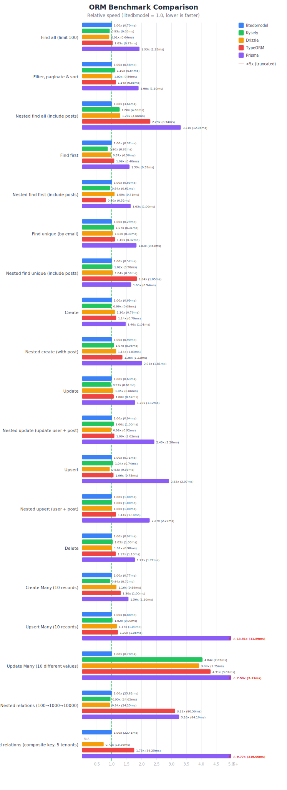

# litedbmodel

A lightweight TypeScript ORM for PostgreSQL, MySQL, and SQLite with Active Record pattern.

## Features

- **Symbol-Based Columns** — `Model.column` enables IDE "Find References" and "Rename Symbol"
- **Type-Safe Conditions** — Compile-time validation with `[Column, value]` tuples
- **Subquery Support** — IN/NOT IN/EXISTS/NOT EXISTS with correlated subqueries
- **Declarative SKIP** — Conditional fields without if-statements
- **Automatic N+1 Prevention** — Batch loading for lazy relations
- **Middleware** — Cross-cutting concerns (logging, auth, tenant isolation)
- **Multi-Database** — PostgreSQL, MySQL, SQLite support

## Installation

```bash
npm install litedbmodel reflect-metadata

# Plus your database driver:
npm install pg            # PostgreSQL
npm install mysql2        # MySQL
npm install better-sqlite3  # SQLite
```

## Quick Start

```typescript
import 'reflect-metadata';
import { DBModel, model, column, ColumnsOf } from 'litedbmodel';

// 1. Define model
@model('users')
class UserModel extends DBModel {
  @column() id?: number;
  @column() name?: string;
  @column() email?: string;
  @column() is_active?: boolean;
}
export const User = UserModel as typeof UserModel & ColumnsOf<UserModel>;

// 2. Configure database
DBModel.setConfig({
  host: 'localhost',
  database: 'mydb',
  user: 'user',
  password: 'pass',
  // driver: 'mysql',    // for MySQL
  // driver: 'sqlite',   // for SQLite (use database: './data.db')
});

// 3. CRUD operations
const user = await User.create([
  [User.name, 'John'],
  [User.email, 'john@example.com'],
]);

const users = await User.find([[User.is_active, true]]);
const john = await User.findOne([[User.email, 'john@example.com']]);

await User.update([[User.id, 1]], [[User.name, 'Jane']]);
await User.delete([[User.is_active, false]]);
```

---

## Type-Safe Conditions

All conditions use compile-time validated `[Column, value]` tuples:

```typescript
// Equality
await User.find([[User.status, 'active']]);

// Operators
await User.find([[`${User.age} > ?`, 18]]);
await User.find([[`${User.age} BETWEEN ? AND ?`, [18, 65]]]);
await User.find([[`${User.name} LIKE ?`, '%test%']]);
await User.find([[`${User.status} IN (?)`, ['a', 'b']]]);

// NULL checks
await User.find([[`${User.deleted_at} IS NULL`]]);

// OR conditions (type-safe)
await User.find([
  [User.is_active, true],
  User.or(
    [[User.role, 'admin']],
    [[User.role, 'moderator']],
  ),
]);

// ORDER BY
await User.find([[User.is_active, true]], { 
  order: User.created_at.desc() 
});
```

---

## Subquery Conditions

IN/NOT IN and EXISTS/NOT EXISTS subqueries with composite key support:

```typescript
import { parentRef } from 'litedbmodel';

// IN subquery (type-safe: selectColumns determine target table)
await User.find([
  User.inSubquery([User.id], [Order.user_id], [
    [Order.status, 'paid']
  ])
]);
// → WHERE users.id IN (SELECT orders.user_id FROM orders WHERE orders.status = 'paid')

// Composite key IN subquery
await User.find([
  User.inSubquery(
    [User.id, User.group_id],           // Parent columns (must belong to User)
    [Order.user_id, Order.group_id],    // SELECT columns (determines target table)
    [[Order.status, 'active']]          // WHERE conditions
  )
]);
// → WHERE (users.id, users.group_id) IN (SELECT orders.user_id, orders.group_id FROM orders WHERE orders.status = 'active')

// NOT IN subquery
await User.find([
  User.notInSubquery([User.id], [BannedUser.user_id])
]);
// → WHERE users.id NOT IN (SELECT banned_users.user_id FROM banned_users)

// Correlated subquery with parentRef
await User.find([
  User.inSubquery([User.id], [Order.user_id], [
    [Order.tenant_id, parentRef(User.tenant_id)],
    [Order.status, 'completed']
  ])
]);
// → WHERE users.id IN (SELECT orders.user_id FROM orders WHERE orders.tenant_id = users.tenant_id AND orders.status = 'completed')

// EXISTS subquery (conditions determine target table)
await User.find([
  [User.is_active, true],
  User.exists([
    [Order.user_id, parentRef(User.id)]
  ])
]);
// → WHERE is_active = TRUE AND EXISTS (SELECT 1 FROM orders WHERE orders.user_id = users.id)

// NOT EXISTS subquery
await User.find([
  User.notExists([
    [Complaint.user_id, parentRef(User.id)]
  ])
]);
// → WHERE NOT EXISTS (SELECT 1 FROM complaints WHERE complaints.user_id = users.id)
```

---

## Declarative SKIP Pattern

Conditional fields without if-statements:

```typescript
import { SKIP } from 'litedbmodel';

// ❌ Imperative
const updates = [];
if (body.name !== undefined) updates.push([User.name, body.name]);
if (body.email !== undefined) updates.push([User.email, body.email]);
await User.update([[User.id, id]], updates);

// ✅ Declarative with SKIP
await User.update([[User.id, id]], [
  [User.name, body.name ?? SKIP],
  [User.email, body.email ?? SKIP],
  [User.updated_at, new Date()],
]);
```

Works for conditions too:

```typescript
await User.find([
  [User.deleted, false],
  [`${User.name} LIKE ?`, query.name ? `%${query.name}%` : SKIP],
  [User.status, query.status ?? SKIP],
]);
```

---

## Column Decorators

### Auto-Inferred Types

```typescript
@column() id?: number;           // Number conversion
@column() name?: string;         // No conversion
@column() is_active?: boolean;   // Boolean conversion
@column() created_at?: Date;     // DateTime conversion
@column() large_id?: bigint;     // BigInt conversion
@column('db_col') prop?: string; // Custom column name
```

### Explicit Types (for arrays/JSON)

```typescript
@column.date() birth_date?: Date;
@column.stringArray() tags?: string[];
@column.intArray() scores?: number[];
@column.json<Settings>() settings?: Settings;
```

---

## Upsert (ON CONFLICT)

```typescript
// Insert or ignore
await User.create(
  [[User.name, 'John'], [User.email, 'john@example.com']],
  { onConflict: User.email, onConflictIgnore: true }
);

// Insert or update
await User.create(
  [[User.name, 'John'], [User.email, 'john@example.com']],
  { onConflict: User.email, onConflictUpdate: [User.name] }
);

// Composite unique key
await UserPref.create(
  [[UserPref.user_id, 1], [UserPref.key, 'theme'], [UserPref.value, 'dark']],
  { onConflict: [UserPref.user_id, UserPref.key], onConflictUpdate: [UserPref.value] }
);
```

---

## Lazy Loading Relations

```typescript
@model('posts')
class PostModel extends DBModel {
  @column() id?: number;
  @column() user_id?: number;
  @column() title?: string;

  get author(): Promise<User | null> {
    return this._belongsTo(User, { targetKey: User.id, sourceKey: Post.user_id });
  }

  get comments(): Promise<Comment[]> {
    return this._hasMany(Comment, { targetKey: Comment.post_id });
  }
}

// Usage
const post = await Post.findOne([[Post.id, 1]]);
const author = await post.author;       // Lazy loaded
const comments = await post.comments;   // Lazy loaded
```

### Composite Key Relations

```typescript
get author(): Promise<User | null> {
  return this._belongsTo(User, {
    targetKeys: [User.tenant_id, User.id],
    sourceKeys: [Post.tenant_id, Post.user_id],
  });
}
```

### Automatic N+1 Prevention

When `find()` returns multiple records, batch loading is **automatic**:

```typescript
const users = await User.find([]);  // Auto batch context created

for (const user of users) {
  const posts = await user.posts;   // First access batch loads ALL
}
// Total: 2 queries instead of N+1!
```

---

## Transactions

```typescript
// Basic
await DBModel.transaction(async () => {
  const user = await User.findOne([[User.id, 1]]);
  await Account.update([[Account.user_id, user.id]], [[Account.balance, 100]]);
});

// With return value
const user = await DBModel.transaction(async () => {
  return await User.create([[User.name, 'Alice']]);
});

// Auto-retry on deadlock
await DBModel.transaction(
  async () => { /* ... */ },
  { retry_on_error: true, retry_limit: 3 }
);

// Preview mode (rollback after execution)
await DBModel.transaction(
  async () => { /* ... */ },
  { rollbackOnly: true }
);
```

---

## Middleware

Class-based middleware for cross-cutting concerns:

```typescript
import { Middleware, NextExecute, ExecuteResult } from 'litedbmodel';

class LoggerMiddleware extends Middleware {
  queries: string[] = [];

  async execute(next: NextExecute, sql: string, params?: unknown[]): Promise<ExecuteResult> {
    this.queries.push(sql);
    const start = Date.now();
    const result = await next(sql, params);
    console.log(`${sql} (${Date.now() - start}ms)`);
    return result;
  }
}

DBModel.use(LoggerMiddleware);

// Per-request access
const ctx = LoggerMiddleware.getCurrentContext();
console.log(ctx.queries);
```

### Tenant Isolation Example

```typescript
class TenantMiddleware extends Middleware {
  tenantId: number = 0;

  async find<T extends typeof DBModel>(model: T, next: NextFind<T>, conditions: Conds) {
    const tenantCol = (model as any).tenant_id;
    if (tenantCol) {
      conditions = [[tenantCol, this.tenantId], ...conditions];
    }
    return next(conditions);
  }
}

// In request handler
TenantMiddleware.getCurrentContext().tenantId = req.user.tenantId;
```

---

## Raw SQL

```typescript
// Raw rows
const result = await DBModel.execute(
  'SELECT COUNT(*) as cnt FROM users WHERE status = $1',
  ['active']
);

// Model instances
const users = await User.query(
  'SELECT * FROM users WHERE created_at > $1',
  ['2024-01-01']
);
```

---

## Comparison

| Feature | litedbmodel | Kysely | Drizzle | TypeORM | Prisma |
|---------|-------------|--------|---------|---------|--------|
| **Install Size** | ~1MB | ~6MB | ~11MB | ~28MB | ~78MB |
| **IDE Refactoring** | ✅ | ❌ | ❌ | ❌ | ❌ |
| **Pattern** | Active Record | Query Builder | Query Builder | Both | Data Mapper |
| **SKIP Pattern** | ✅ | ❌ | ❌ | ❌ | ❌ |
| **Auto N+1 Prevention** | ✅ | ❌ | ❌ | Eager only | Include |
| **Middleware** | ✅ | ❌ | ❌ | Subscribers | ❌ |

### Performance (PostgreSQL, Median of 1,000 iterations)

Based on [Prisma orm-benchmarks](https://github.com/prisma/orm-benchmarks) methodology.



| Operation | litedbmodel | Kysely | Drizzle | TypeORM | Prisma |
|-----------|-------------|--------|---------|---------|--------|
| Filter, paginate & sort | **0.70ms** 🏆 | 0.71ms | 0.75ms | 0.81ms | 1.15ms |
| Nested find all | **2.41ms** 🏆 | 2.84ms | 3.49ms | 5.35ms | 8.02ms |
| Create | **0.41ms** 🏆 | 0.43ms | 0.44ms | 0.94ms | 0.60ms |
| Nested create | **0.86ms** 🏆 | 0.88ms | 0.96ms | 2.20ms | 1.79ms |
| Delete | **1.01ms** 🏆 | 1.01ms | 1.08ms | 1.88ms | 1.41ms |
| Find all | 0.64ms | 0.64ms | **0.59ms** | 0.73ms | 1.39ms |

> **litedbmodel is fastest in 4 out of 14 operations**, especially in nested queries and complex filtering. See [COMPARISON.md](./COMPARISON.md) for full benchmark results.

### Choose litedbmodel when:

- You need **IDE refactoring** (Find References, Rename Symbol)
- You prefer **Active Record** pattern
- You want **declarative** conditional fields (SKIP)
- You need **automatic N+1 prevention**
- Performance matters (1.4x - 3.3x faster than Prisma)

### Choose Prisma when:

- You need **rich DX features** (Prisma Studio, migrations)
- **Rapid prototyping** is priority

### Choose Kysely/Drizzle when:

- You prefer **Query Builder** pattern
- Maximum single-row write performance is critical

---

## License

MIT
