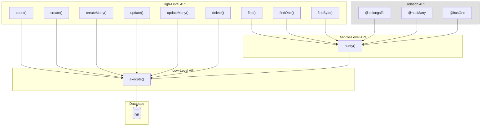

# litedbmodel

[](https://www.npmjs.com/package/litedbmodel)
[](https://opensource.org/licenses/MIT)

**[📖 API Documentation](https://github.com/foo-ogawa/litedbmodel.ts/blob/main/docs/api/README.md)**

litedbmodel is a lightweight, SQL-friendly TypeScript ORM for PostgreSQL, MySQL, and SQLite.
It is designed for production systems where you care about **predictable SQL**, **explicit performance control**, and **operational safety** (replication lag, N+1, accidental full scans).


## Philosophy

### SQL is not the enemy — opacity is.
Most ORMs hide SQL behind abstractions that are hard to debug and hard to tune.
litedbmodel keeps SQL visible and controllable: generated queries are intentionally simple, and complex cases use real SQL via `query()` / `execute()`.

### Make performance the default, not a post-mortem
- Lazy relations are supported, but **N+1 is prevented automatically** via batch loading.
- Per-parent limiting is done at the **SQL level** (efficient “top-N per group” patterns).
- Write operations default to **no RETURNING** for throughput; request PKs via `PkeyResult` only when needed.

### Production safety over convenience magic
- Supports **reader/writer routing** for read replicas and replication-lag-aware reads.
- Write operations (`create/createMany, update/updateMany, delete`) require an explicit **transaction boundary**.
- Configurable **hard limits** detect accidental over-fetching early.

### Refactoring-friendly, without sacrificing SQL control
- Column references are **symbol-based** (`Model.column`) so IDE rename/find-references work.
- Conditions are **type-safe tuples** (`[Column, value]`), and an ESLint plugin catches mistakes TS cannot.

> See [Design Philosophy](./docs/BENCHMARK-NESTED.md#litedbmodels-design-philosophy) for detailed comparison with query-centric ORMs.

## Key Features

### SQL Control & Modeling
- Predictable generated SQL (readable, hand-written style)
- Raw SQL escape hatch: `Model.query()` / `DBModel.execute()`
- Query-based models for complex reads (aggregations, JOINs, CTEs)

### Performance by Default
- Transparent N+1 prevention (automatic batch loading for lazy relations)
- SQL-level per-parent limit for relations
- Subqueries: IN/EXISTS with correlated conditions

### Operational Readiness
- Reader/Writer separation with sticky-writer reads after transactions (replication-lag-aware)
- Transactions with retry options (e.g., deadlock retry)
- Safety guards: `findHardLimit` / `hasManyHardLimit`

### Developer Experience
- Symbol-based columns + tuple conditions for refactoring safety
- Declarative `SKIP` pattern for optional fields/conditions
- Middleware for cross-cutting concerns (logging, auth, tenant isolation)
- Multi-database support (portable tuple API; raw SQL is dialect-dependent)

## When litedbmodel is a good fit

Choose litedbmodel if you:
- Build **large or high-throughput** services where SQL tuning and explain plans matter
- Want ORM ergonomics, but refuse to lose the ability to write/own SQL
- Operate with **read replicas** and care about replication lag and routing rules
- Need safe defaults against “oops, loaded 10M rows” and N+1 regressions
- Prefer a model-centric approach (list/detail + relations) with predictable behavior

## When it may NOT be a good fit

litedbmodel may be a poor fit if you:
- Want a “fully abstracted” ORM that hides SQL entirely
- Prefer a query-builder DSL as the primary interface (rather than SQL/tuple conditions)
- Need database-agnostic portability for complex raw SQL (dialect differences are real)

## Non-goals

Non-goals are deliberate trade-offs to keep SQL predictable and operations safe.
litedbmodel is intentionally **not** trying to be a “do-everything” ORM.

- **100% database-agnostic SQL**: complex queries are expected to use real SQL, and SQL dialect differences are real.
- **Migrations as a built-in feature**: schema migrations are out of scope (use your preferred migration tool).
- **Hiding SQL behind a large abstraction layer**: we prioritize predictable SQL over a fully abstracted API.
- **Automatic eager-loading everywhere**: relations are lazy by default; performance characteristics should stay explicit and controllable.

---

## Installation

```bash
npm install litedbmodel reflect-metadata

# Plus your database driver:
npm install pg            # PostgreSQL
npm install mysql2        # MySQL
npm install better-sqlite3  # SQLite
```

## Quick Start

```typescript
import 'reflect-metadata';
import { DBModel, model, column } from 'litedbmodel';

// 1. Define model
@model('users')
class UserModel extends DBModel {
  @column() id?: number;
  @column() name?: string;
  @column() email?: string;
  @column() is_active?: boolean;
}
export const User = UserModel.asModel();  // Adds type-safe column references

// 2. Configure database
DBModel.setConfig({
  host: 'localhost',
  database: 'mydb',
  user: 'user',
  password: 'pass',
  // driver: 'mysql',    // for MySQL
  // driver: 'sqlite',   // for SQLite (use database: './data.db')
});

// 3. CRUD operations
await User.create([
  [User.name, 'John'],
  [User.email, 'john@example.com'],
]);
await User.update([[User.id, 1]], [[User.name, 'Jane']]);
await User.delete([[User.is_active, false]]);

// Read operations
const users = await User.find([[User.is_active, true]]);
const john = await User.findOne([[User.email, 'john@example.com']]);

// With returning: true → get PkeyResult for re-fetching
const created = await User.create([...], { returning: true });
const [newUser] = await User.findById(created);
```

---

## Model Options

The `@model` decorator accepts optional configuration for default behaviors:

```typescript
@model('entries', {
  order: () => Entry.created_at.desc(),      // DEFAULT_ORDER
  filter: () => [[Entry.is_deleted, false]], // FIND_FILTER (auto-applied)
  select: 'id, title, created_at',           // SELECT_COLUMN
  updateTable: 'entries_writable',           // UPDATE_TABLE_NAME (for views)
})
class EntryModel extends DBModel {
  @column() id?: number;
  @column() title?: string;
  @column() created_at?: Date;
  @column.boolean() is_deleted?: boolean;
}
export const Entry = EntryModel.asModel();
```

| Option | Type | Description |
|--------|------|-------------|
| `order` | `() => OrderSpec` | Default ORDER BY for `find()` |
| `filter` | `() => Conds` | Auto-applied WHERE conditions |
| `select` | `string` | Default SELECT columns |
| `updateTable` | `string` | Table name for INSERT/UPDATE |
| `group` | `() => Column \| string` | Default GROUP BY |

> **Note:** Options using model columns (`order`, `filter`, `group`) require lazy evaluation `() =>` because the model isn't fully defined when the decorator runs.

---

## Column Decorators

### Auto-Inferred Types

Types are inferred from TypeScript property types:

```typescript
@column() id?: number;           // Number conversion
@column() name?: string;         // No conversion
@column() is_active?: boolean;   // Boolean conversion
@column() created_at?: Date;     // DateTime conversion
@column() large_id?: bigint;     // BigInt conversion
```

### Column Options

```typescript
@column('db_column_name') prop?: string;         // Custom column name (string shorthand)
@column({ columnName: 'db_col' }) prop?: string; // Custom column name (object form)
@column({ primaryKey: true }) id?: number;       // Mark as primary key
@column({ primaryKey: true, columnName: 'user_id' }) id?: number; // Both options
```

| Option | Type | Description |
|--------|------|-------------|
| `columnName` | `string` | Database column name (defaults to property name) |
| `primaryKey` | `boolean` | Mark as part of primary key (for `getPkey()`) |

### Explicit Types (for arrays/JSON/UUID)

Use explicit type decorators when auto-inference isn't sufficient:

```typescript
@column.date() birth_date?: Date;           // Date only (no time)
@column.datetime() updated_at?: Date;       // DateTime with timezone
@column.boolean() is_active?: boolean;      // Explicit boolean
@column.number() amount?: number;           // Explicit number
@column.uuid() id?: string;                 // UUID with auto-casting (PostgreSQL)
@column.stringArray() tags?: string[];      // String array
@column.intArray() scores?: number[];       // Integer array
@column.numericArray() prices?: number[];   // Numeric/decimal array
@column.booleanArray() flags?: boolean[];   // Boolean array
@column.datetimeArray() dates?: Date[];     // DateTime array
@column.json<Settings>() settings?: Settings; // JSON with type
```

### UUID Columns

The `@column.uuid()` decorator handles database-specific SQL casting automatically:

```typescript
@model('users')
class UserModel extends DBModel {
  @column.uuid({ primaryKey: true }) id?: string;  // UUID primary key
  @column() name?: string;
}
export const User = UserModel.asModel();

// Queries use correct casting per driver
await User.find([[User.id, '123e4567-e89b-12d3-a456-426614174000']]);
```

| Database | Generated SQL | Notes |
|----------|---------------|-------|
| PostgreSQL | `WHERE id = ?::uuid` | Cast prevents "operator does not exist: uuid = text" |
| SQLite | `WHERE id = ?` | UUID stored as TEXT, no cast needed |
| MySQL | `WHERE id = ?` | UUID stored as CHAR(36), no cast needed |

The casting is applied automatically for:
- Conditions (`find()`, `findOne()`, `update()`, `delete()`)
- Column methods (`User.id.eq()`, `User.id.in()`, etc.)
- INSERT/UPDATE values

---

## CRUD Operations

### PkeyResult Type

Write operations can optionally return a `PkeyResult` object:

```typescript
interface PkeyResult {
  key: Column[];       // Key column(s) used to identify rows
  values: unknown[][]; // 2D array of key values
}

// Single PK example
{ key: [User.id], values: [[1], [2], [3]] }

// Composite PK example
{ key: [TenantUser.tenant_id, TenantUser.id], values: [[1, 100], [1, 101]] }
```

**Default behavior:** `returning: false` — returns `null` for better performance.  
**With `returning: true`:** Returns `PkeyResult` with affected primary keys.

> **Note:** `PkeyResult.key` always contains primary key column(s), regardless of `keyColumns` used in `updateMany`.

### create / createMany

```typescript
// Default: returns null (no RETURNING)
await User.create([
  [User.name, 'John'],
  [User.email, 'john@example.com'],
]);

// With returning: true → returns PkeyResult
const result = await User.create([
  [User.name, 'John'],
  [User.email, 'john@example.com'],
], { returning: true });
// result: { key: [User.id], values: [[1]] }

// Multiple records
const result = await User.createMany([
  [[User.name, 'John'], [User.email, 'john@example.com']],
  [[User.name, 'Jane'], [User.email, 'jane@example.com']],
], { returning: true });
// result: { key: [User.id], values: [[1], [2]] }

// Fetch created records if needed
const [user] = await User.findById(result);
```

### update / updateMany

```typescript
// Default: returns null (no RETURNING)
await User.update(
  [[User.status, 'pending']],        // conditions
  [[User.status, 'active']],         // values
);

// With returning: true → returns PkeyResult
const result = await User.update(
  [[User.status, 'pending']],
  [[User.status, 'active']],
  { returning: true }
);
// result: { key: [User.id], values: [[1], [2], [3]] }

// Bulk update with different values per row
const result = await User.updateMany([
  [[User.id, 1], [User.name, 'John'], [User.email, 'john@example.com']],
  [[User.id, 2], [User.name, 'Jane'], [User.email, 'jane@example.com']],
], { keyColumns: [User.id], returning: true });
// result: { key: [User.id], values: [[1], [2]] }

// Fetch updated records if needed
const users = await User.findById(result);
```

**Generated SQL for updateMany:**

| Database | SQL |
|----------|-----|
| PostgreSQL | `UPDATE ... FROM UNNEST($1::int[], $2::text[], ...) AS v(...) WHERE t.id = v.id` |
| MySQL 8.0.19+ | `UPDATE ... JOIN (VALUES ROW(?, ?, ?), ...) AS v(...) ON ... SET ...` |
| SQLite 3.33+ | `WITH v(...) AS (VALUES (...), ...) UPDATE ... FROM v WHERE ...` |

### delete

```typescript
// Default: returns null (no RETURNING)
await User.delete([[User.is_active, false]]);

// With returning: true → returns PkeyResult
const result = await User.delete([[User.is_active, false]], { returning: true });
// result: { key: [User.id], values: [[4], [5]] }
```

### findById

Fetch records by primary key. Accepts `PkeyResult` format for efficient batch loading:

```typescript
// Single record
const [user] = await User.findById({ values: [[1]] });

// Multiple records
const users = await User.findById({ values: [[1], [2], [3]] });

// Composite PK
const [entry] = await TenantUser.findById({
  values: [[1, 100]]  // [tenant_id, id]
});

// Use with update/delete result
const result = await User.update(...);
const users = await User.findById(result);
```

**Generated SQL:**

| Database | Single PK | Composite PK |
|----------|-----------|--------------|
| PostgreSQL | `WHERE id = ANY($1::int[])` | `WHERE (col1, col2) IN (SELECT * FROM UNNEST(...))` |
| MySQL | `WHERE id IN (?, ?, ?)` | `JOIN (VALUES ROW(...), ...) AS v ON ...` |
| SQLite | `WHERE id IN (?, ?, ?)` | `WITH v AS (VALUES ...) ... JOIN v ON ...` |

### Upsert (ON CONFLICT)

```typescript
// Insert or ignore
await User.create(
  [[User.name, 'John'], [User.email, 'john@example.com']],
  { onConflict: User.email, onConflictIgnore: true }
);

// Insert or update
await User.create(
  [[User.name, 'John'], [User.email, 'john@example.com']],
  { onConflict: User.email, onConflictUpdate: [User.name] }
);

// Composite unique key
await UserPref.create(
  [[UserPref.user_id, 1], [UserPref.key, 'theme'], [UserPref.value, 'dark']],
  { onConflict: [UserPref.user_id, UserPref.key], onConflictUpdate: [UserPref.value] }
);
```

### Behavior Notes

#### PkeyResult Semantics

| Aspect | Behavior |
|--------|----------|
| **Order** | Matches database `RETURNING` order (not guaranteed across DBs; `findById(result)` order is also unspecified) |
| **update result** | Contains PKs of **matched rows** (rows matching WHERE condition, regardless of whether values actually changed) |
| **delete result** | Contains PKs of **deleted rows** |
| **Duplicates** | No duplicates (each row appears once; MySQL pre-SELECT uses `DISTINCT`) |
| **Empty result** | `{ key: [...], values: [] }` when no rows affected (not `null`) |

> **Note:** For MySQL (no `RETURNING`), when `returning: true`:
> - `update`/`delete`: Executes pre-SELECT (with `DISTINCT`) to get PKs, then executes the operation (2 queries in same transaction)
> - `updateMany`: Executes update, then SELECT to get PKs of affected rows (2 queries in same transaction)
> - When `returning: false` (default): Single query, returns `null`

#### Batch Limits

`createMany` and `updateMany` do **not** auto-split large batches. Users are responsible for chunking:

```typescript
// Recommended: chunk large batches (DB-dependent limits)
const BATCH_SIZE = 1000;  // Adjust based on your DB and row size
for (let i = 0; i < rows.length; i += BATCH_SIZE) {
  const chunk = rows.slice(i, i + BATCH_SIZE);
  await User.updateMany(chunk, { keyColumns: [User.id] });
}
```

| Database | Practical Limits |
|----------|------------------|
| PostgreSQL | ~32,767 parameters per query |
| MySQL | `max_allowed_packet` (default 64MB), ~65,535 placeholders |
| SQLite | 999 variables (compile-time `SQLITE_MAX_VARIABLE_NUMBER`) |

#### updateMany keyColumns Contract

| Requirement | Description |
|-------------|-------------|
| **Must be unique** | `keyColumns` must uniquely identify rows (primary key or unique constraint) |
| **Must exist in rows** | Every row must include all `keyColumns` |
| **Non-key columns** | Columns not in `keyColumns` become `SET` clause values |

```typescript
// ✅ Valid: keyColumns is primary key
await User.updateMany([
  [[User.id, 1], [User.name, 'John']],
], { keyColumns: [User.id] });

// ✅ Valid: keyColumns is unique constraint
await User.updateMany([
  [[User.email, 'john@example.com'], [User.name, 'John']],
], { keyColumns: [User.email] });  // If email has UNIQUE constraint

// ❌ Invalid: keyColumns missing from row
await User.updateMany([
  [[User.name, 'John']],  // Missing User.id!
], { keyColumns: [User.id] });
```

---

## Type-Safe Conditions

Conditions use `[Column, value]` tuples for compile-time validation. For operators, use `${Model.column}` in template literals—the ESLint plugin catches incorrect column references.

```typescript
// Equality: compile-time type-safe via Column symbols
await User.find([[User.status, 'active']]);

// Operators: ESLint plugin validates ${Model.column} references
await User.find([[`${User.age} > ?`, 18]]);
await User.find([[`${User.age} BETWEEN ? AND ?`, [18, 65]]]);
await User.find([[`${User.name} LIKE ?`, '%test%']]);
await User.find([[`${User.status} IN (?)`, ['a', 'b']]]);

// NULL checks: ESLint plugin validates column reference
await User.find([[`${User.deleted_at} IS NULL`]]);

// OR conditions: inner tuples are compile-time type-safe
await User.find([
  [User.is_active, true],
  User.or(
    [[User.role, 'admin']],
    [[User.role, 'moderator']],
  ),
]);

// ORDER BY
await User.find([[User.is_active, true]], { 
  order: User.created_at.desc() 
});
```

> **ESLint Plugin:** Use `litedbmodel/eslint-plugin` to catch mistakes that TypeScript cannot:
> - Wrong model columns (e.g., `User.find([[Post.id, 1]])`)
> - Hardcoded column names instead of `${Model.column}`
> - Missing `declare` keyword for relation properties

---

## Subquery Conditions

IN/NOT IN and EXISTS/NOT EXISTS subqueries with composite key support.
Key pairs use the same format as relation decorators: `[[parentCol, targetCol], ...]`

```typescript
import { parentRef } from 'litedbmodel';

// IN subquery - key pairs: [[parentCol, targetCol]]
await User.find([
  User.inSubquery([[User.id, Order.user_id]], [
    [Order.status, 'paid']
  ])
]);
// → WHERE users.id IN (SELECT orders.user_id FROM orders WHERE orders.status = 'paid')

// Composite key IN subquery
await User.find([
  User.inSubquery([
    [User.id, Order.user_id],
    [User.group_id, Order.group_id],
  ], [[Order.status, 'active']])
]);
// → WHERE (users.id, users.group_id) IN (SELECT orders.user_id, orders.group_id FROM orders WHERE orders.status = 'active')

// NOT IN subquery
await User.find([
  User.notInSubquery([[User.id, BannedUser.user_id]])
]);
// → WHERE users.id NOT IN (SELECT banned_users.user_id FROM banned_users)

// Correlated subquery with parentRef
await User.find([
  User.inSubquery([[User.id, Order.user_id]], [
    [Order.tenant_id, parentRef(User.tenant_id)],
    [Order.status, 'completed']
  ])
]);
// → WHERE users.id IN (SELECT orders.user_id FROM orders WHERE orders.tenant_id = users.tenant_id AND orders.status = 'completed')

// EXISTS subquery (conditions determine target table)
await User.find([
  [User.is_active, true],
  User.exists([
    [Order.user_id, parentRef(User.id)]
  ])
]);
// → WHERE is_active = TRUE AND EXISTS (SELECT 1 FROM orders WHERE orders.user_id = users.id)

// NOT EXISTS subquery
await User.find([
  User.notExists([
    [Complaint.user_id, parentRef(User.id)]
  ])
]);
// → WHERE NOT EXISTS (SELECT 1 FROM complaints WHERE complaints.user_id = users.id)
```

---

## Declarative SKIP Pattern

Conditional fields without if-statements:

```typescript
import { SKIP } from 'litedbmodel';

// ❌ Imperative
const updates = [];
if (body.name !== undefined) updates.push([User.name, body.name]);
if (body.email !== undefined) updates.push([User.email, body.email]);
await User.update([[User.id, id]], updates);

// ✅ Declarative with SKIP
await User.update([[User.id, id]], [
  [User.name, body.name ?? SKIP],
  [User.email, body.email ?? SKIP],
  [User.updated_at, new Date()],
]);
```

Works for conditions too:

```typescript
await User.find([
  [User.deleted, false],
  [`${User.name} LIKE ?`, query.name ? `%${query.name}%` : SKIP],
  [User.status, query.status ?? SKIP],
]);
```

---

## Relation Decorators

Define relations declaratively with type-safe decorators:

```typescript
import { DBModel, model, column, hasMany, belongsTo, hasOne } from 'litedbmodel';

@model('users')
class UserModel extends DBModel {
  @column() id?: number;
  @column() name?: string;

  // Use 'declare' for relation properties (not '!' assertion)
  // This prevents TypeScript from creating instance properties that shadow the getter
  @hasMany(() => [User.id, Post.author_id])
  declare posts: Promise<Post[]>;

  @hasOne(() => [User.id, UserProfile.user_id])
  declare profile: Promise<UserProfile | null>;
}
export const User = UserModel.asModel();

@model('posts')
class PostModel extends DBModel {
  @column() id?: number;
  @column() author_id?: number;
  @column() title?: string;

  @belongsTo(() => [Post.author_id, User.id])
  declare author: Promise<User | null>;

  @hasMany(() => [Post.id, Comment.post_id])
  declare comments: Promise<Comment[]>;
}
export const Post = PostModel.asModel();

// Usage
const post = await Post.findOne([[Post.id, 1]]);
const author = await post.author;       // Lazy loaded
const comments = await post.comments;   // Lazy loaded
```

> **Important:** Use `declare` (not `!`) for relation properties. TypeScript class field declarations with `!` create instance properties that shadow the prototype getter. The ESLint plugin detects this mistake.

### With Options (order, where, limit)

```typescript
@hasMany(() => [User.id, Post.author_id], {
  order: () => Post.created_at.desc(),
  where: () => [[Post.is_deleted, false]],
})
declare activePosts: Promise<Post[]>;

// Per-parent limit - fetch only N records per parent key
@hasMany(() => [User.id, Post.author_id], {
  limit: 5,
  order: () => Post.created_at.desc(),
})
declare recentPosts: Promise<Post[]>;  // Each user gets their 5 most recent posts
```

The `limit` option applies SQL-level limiting **per parent key** during batch loading:
- **PostgreSQL**: Uses `LATERAL JOIN` for efficient per-group limiting
- **MySQL/SQLite**: Uses `ROW_NUMBER() OVER (PARTITION BY ...)` window function

This is more efficient than fetching all records and filtering in application code.

> **Important:** Always use `order` with `limit`. Without ordering, the "which N records" is non-deterministic and may vary between queries.

### Composite Key Relations

```typescript
@model('tenant_posts')
class TenantPostModel extends DBModel {
  @column({ primaryKey: true }) tenant_id?: number;
  @column({ primaryKey: true }) id?: number;
  @column() author_id?: number;

  @belongsTo(() => [
    [TenantPost.tenant_id, TenantUser.tenant_id],
    [TenantPost.author_id, TenantUser.id],
  ])
  declare author: Promise<TenantUser | null>;
}
```

### Transparent N+1 Prevention

When `find()` returns multiple records, batch loading is **automatic** — no eager loading specification needed:

```typescript
const users = await User.find([]);  // Auto batch context created

for (const user of users) {
  const posts = await user.posts;   // First access batch loads ALL users' posts
}
// Total: 2 queries instead of N+1!
```

Write natural code (`await user.posts`); litedbmodel handles the optimization.

---

## Query Limits (Safety Guards)

Prevent accidental loading of too many records with configurable hardLimits:

```typescript
// Global configuration
DBModel.setConfig(config, {
  findHardLimit: 1000,       // find() throws if > 1000 records
  hasManyHardLimit: 10000,   // hasMany throws if > 10000 records total (batch)
});

// Or update later
DBModel.setLimitConfig({ findHardLimit: 500, hasManyHardLimit: 5000 });
```

When limits are exceeded, `LimitExceededError` is thrown:

```typescript
import { LimitExceededError } from 'litedbmodel';

try {
  const users = await User.find([]);  // May throw if too many records
} catch (e) {
  if (e instanceof LimitExceededError) {
    console.log(`Limit ${e.limit} exceeded: got ${e.actualCount} records`);
  }
}
```

**Per-relation hardLimit override:**

You can override the global `hasManyHardLimit` for specific relations:

```typescript
@hasMany(() => [User.id, Post.author_id], {
  hardLimit: 500,   // Override global hasManyHardLimit for this relation
})
declare posts: Promise<Post[]>;

@hasMany(() => [User.id, Log.user_id], {
  hardLimit: null,  // Disable limit check for this relation
})
declare logs: Promise<Log[]>;
```

> **Note:** `findHardLimit` and `hasManyHardLimit` are safety guards implemented as `LIMIT N+1` at SQL level. If the result exceeds the limit, it throws immediately — this minimizes data transfer while detecting overflow. For explicit SQL-level limiting (e.g., "N records per parent"), use the `limit` option described in [With Options](#with-options-order-where-limit).

---

## Transactions

```typescript
// Basic
await DBModel.transaction(async () => {
  const user = await User.findOne([[User.id, 1]]);
  await Account.update([[Account.user_id, user.id]], [[Account.balance, 100]]);
});

// With return value
const user = await DBModel.transaction(async () => {
  return await User.create([[User.name, 'Alice']]);
});

// Auto-retry on deadlock
await DBModel.transaction(
  async () => { /* ... */ },
  { retryOnError: true, retryLimit: 3 }
);

// Preview mode (rollback after execution)
await DBModel.transaction(
  async () => { /* ... */ },
  { rollbackOnly: true }
);
```

---

## Middleware

Class-based middleware for cross-cutting concerns.

### Call Flow

All database operations flow through the middleware system:



**Middleware hooks:**
- **Method-level**: `find`, `findOne`, `findById`, `count`, `create`, `createMany`, `update`, `updateMany`, `delete`
- **Instantiation-level**: `query` — returns model instances from raw SQL
- **SQL-level**: `execute` — intercepts ALL SQL queries (SELECT, INSERT, UPDATE, DELETE)

> **Note:** Relation API (`@belongsTo`, `@hasMany`, `@hasOne`) bypasses method-level middleware hooks and calls `query()` directly. To intercept relation queries, use Instantiation-level (`query`) middleware.

### Example

```typescript
import { Middleware, NextExecute, ExecuteResult } from 'litedbmodel';

class LoggerMiddleware extends Middleware {
  queries: string[] = [];

  async execute(next: NextExecute, sql: string, params?: unknown[]): Promise<ExecuteResult> {
    this.queries.push(sql);
    const start = Date.now();
    const result = await next(sql, params);
    console.log(`${sql} (${Date.now() - start}ms)`);
    return result;
  }
}

DBModel.use(LoggerMiddleware);

// Per-request access
const ctx = LoggerMiddleware.getCurrentContext();
console.log(ctx.queries);
```

### Tenant Isolation Example

```typescript
import { Column } from 'litedbmodel';

class TenantMiddleware extends Middleware {
  tenantId: number = 0;

  async find<T extends typeof DBModel>(model: T, next: NextFind<T>, conditions: Conds) {
    const tenantCol = (model as { tenant_id?: Column }).tenant_id;
    if (tenantCol) {
      conditions = [[tenantCol, this.tenantId], ...conditions];
    }
    return next(conditions);
  }
}

// In request handler
TenantMiddleware.getCurrentContext().tenantId = req.user.tenantId;
```

---

# Advanced Features

## Raw SQL Methods

When `find()` isn't enough, use real SQL directly. No query builder translation needed.

> **Portability note:** Tuple API (`find()`, `create()`, `update()`) and relation loading are DB-portable (config-only switching). Raw SQL via `query()` is your escape hatch for DB-specific optimizations—you control the dialect (placeholders, functions, type casts).

### Model.query() — SQL with Type-Safe Results

Execute any SQL and get typed model instances. The SQL you write is exactly what runs.

```typescript
// Complex JOIN with subquery - returns User[] with full type safety
const activeUsers = await User.query(`
  SELECT u.* 
  FROM users u
  INNER JOIN (
    SELECT user_id, COUNT(*) as order_count
    FROM orders
    WHERE created_at >= $1
    GROUP BY user_id
    HAVING COUNT(*) >= $2
  ) active ON u.id = active.user_id
  WHERE u.status = 'active'
  ORDER BY active.order_count DESC
`, [lastMonth, minOrders]);

// Window functions, CTEs, recursive queries - anything PostgreSQL supports
@model('user_rankings')
class UserRankingModel extends DBModel {
  @column() user_id?: number;
  @column() score?: number;
  @column() rank?: number;
  @column() percentile?: number;
}
const UserRanking = UserRankingModel.asModel();

const rankings = await UserRanking.query(`
  WITH ranked AS (
    SELECT 
      user_id,
      score,
      RANK() OVER (PARTITION BY category ORDER BY score DESC) as rank,
      PERCENT_RANK() OVER (PARTITION BY category ORDER BY score) as percentile
    FROM user_scores
    WHERE created_at >= $1
  )
  SELECT * FROM ranked WHERE rank <= 100
`, [startDate]);
// rankings: UserRanking[] - full IDE autocomplete, type checking
```

### DBModel.execute() - Non-Model Operations

Use `execute()` for DDL, maintenance, and operations that don't return model instances:

```typescript
// Materialized view refresh
await DBModel.execute('REFRESH MATERIALIZED VIEW CONCURRENTLY monthly_sales_summary');

// Database maintenance
await DBModel.execute('VACUUM ANALYZE orders');

// Stored procedure / function calls
await DBModel.execute('SELECT process_daily_aggregates($1)', [targetDate]);
await DBModel.execute('SELECT pg_notify($1, $2)', ['events', JSON.stringify(payload)]);

// DDL operations
await DBModel.execute('CREATE INDEX CONCURRENTLY idx_orders_date ON orders(created_at)');
```

### When to Use Each Method

| Method | Use Case | Returns |
|--------|----------|---------|
| `Model.find()` | Simple queries with conditions | `Model[]` |
| `Model.query()` | Complex SQL returning model data | `Model[]` |
| `DBModel.execute()` | DDL, maintenance, procedures | `{ rows, rowCount }` |
| Query-Based Models | Reusable complex queries | `Model[]` via `find()` |

---

## Query-Based Models

Define models backed by complex SQL queries instead of simple tables.
Use `find()`, `findOne()`, `count()` on JOINs, aggregations, CTEs, and analytics queries.

### Basic Concept

```typescript
import { DBModel, model, column } from 'litedbmodel';

@model('user_stats')  // Alias for the CTE
class UserStatsModel extends DBModel {
  @column() id?: number;
  @column() name?: string;
  @column() post_count?: number;
  @column() comment_count?: number;
  @column() last_activity?: Date;

  // Define the base query
  static QUERY = `
    SELECT 
      u.id,
      u.name,
      COUNT(DISTINCT p.id) AS post_count,
      COUNT(DISTINCT c.id) AS comment_count,
      GREATEST(MAX(p.created_at), MAX(c.created_at)) AS last_activity
    FROM users u
    LEFT JOIN posts p ON u.id = p.user_id
    LEFT JOIN comments c ON u.id = c.user_id
    WHERE u.deleted_at IS NULL
    GROUP BY u.id, u.name
  `;
}
export const UserStats = UserStatsModel.asModel();

// Use find() with additional conditions
const topContributors = await UserStats.find([
  [`${UserStats.post_count} >= ?`, 10],
  [`${UserStats.last_activity} > ?`, lastWeek],
], { order: UserStats.post_count.desc(), limit: 100 });
```

### Generated SQL (CTE-based)

When `find()` is called, the QUERY becomes a CTE (WITH clause):

```sql
WITH user_stats AS (
  SELECT 
    u.id,
    u.name,
    COUNT(DISTINCT p.id) AS post_count,
    COUNT(DISTINCT c.id) AS comment_count,
    GREATEST(MAX(p.created_at), MAX(c.created_at)) AS last_activity
  FROM users u
  LEFT JOIN posts p ON u.id = p.user_id
  LEFT JOIN comments c ON u.id = c.user_id
  WHERE u.deleted_at IS NULL
  GROUP BY u.id, u.name
)
SELECT * FROM user_stats
WHERE post_count >= $1 AND last_activity > $2
ORDER BY post_count DESC
LIMIT 100
```

### Parameterized Queries

For queries that need runtime parameters, define a factory method that encapsulates the query:

```typescript
@model('sales_report')
class SalesReportModel extends DBModel {
  @column() product_id?: number;
  @column() product_name?: string;
  @column() total_quantity?: number;
  @column() total_revenue?: number;
  @column() order_count?: number;

  // Factory method - encapsulates query construction
  static forPeriod(startDate: string, endDate: string) {
    return this.withQuery({
      sql: `
        SELECT 
          p.id AS product_id,
          p.name AS product_name,
          SUM(oi.quantity) AS total_quantity,
          SUM(oi.quantity * oi.unit_price) AS total_revenue,
          COUNT(DISTINCT o.id) AS order_count
        FROM products p
        INNER JOIN order_items oi ON p.id = oi.product_id
        INNER JOIN orders o ON oi.order_id = o.id
        WHERE o.status = 'completed'
          AND o.created_at >= $1 
          AND o.created_at < $2
        GROUP BY p.id, p.name
      `,
      params: [startDate, endDate],
    });
  }
}
export const SalesReport = SalesReportModel.asModel();

// Usage: Clean, encapsulated API
const Q1Report = SalesReport.forPeriod('2024-01-01', '2024-04-01');
const topProducts = await Q1Report.find([
  [`${SalesReport.total_revenue} > ?`, 10000],
], { order: SalesReport.total_revenue.desc() });
```

### Generated SQL

```sql
WITH sales_report AS (
  SELECT 
    p.id AS product_id,
    p.name AS product_name,
    SUM(oi.quantity) AS total_quantity,
    SUM(oi.quantity * oi.unit_price) AS total_revenue,
    COUNT(DISTINCT o.id) AS order_count
  FROM products p
  INNER JOIN order_items oi ON p.id = oi.product_id
  INNER JOIN orders o ON oi.order_id = o.id
  WHERE o.status = 'completed'
    AND o.created_at >= $1 
    AND o.created_at < $2
  GROUP BY p.id, p.name
)
SELECT * FROM sales_report
WHERE total_revenue > $3
ORDER BY total_revenue DESC
```

### Type-Safe Column References

Use Column symbols in your QUERY for refactoring safety:

```typescript
@model('user_activity')
class UserActivityModel extends DBModel {
  @column() user_id?: number;
  @column() user_name?: string;
  @column() total_posts?: number;

  static QUERY = `
    SELECT 
      ${User.id} AS user_id,
      ${User.name} AS user_name,
      COUNT(${Post.id}) AS total_posts
    FROM ${User.TABLE_NAME}
    LEFT JOIN ${Post.TABLE_NAME} ON ${User.id} = ${Post.user_id}
    GROUP BY ${User.id}, ${User.name}
  `;
}
```

### Use Cases

| Use Case | Example |
|----------|---------|
| **Aggregations** | User stats, sales reports, leaderboards |
| **Analytics** | Cohort analysis, funnel metrics, trend data |
| **Denormalized Views** | Pre-joined data for read-heavy operations |
| **Time-Series** | Period-based summaries with window functions |
| **Recursive Queries** | Organizational hierarchies, category trees |

### Design Considerations

1. **Read-Only**: Query-based models don't support `create()`, `update()`, `delete()`
2. **CTE vs Subquery**: CTE approach produces cleaner, more readable SQL
3. **Parameter Ordering**: QUERY params come first, then `find()` condition params
4. **Caching**: Consider materializing frequently-used query models as actual views

---

## Reader/Writer Separation

For production deployments with read replicas, litedbmodel supports automatic connection routing.

### Configuration

```typescript
DBModel.setConfig(
  { host: 'reader.db.example.com', database: 'mydb', ... },  // reader (default)
  {
    writerConfig: { host: 'writer.db.example.com', database: 'mydb', ... },
    
    // Keep using writer after transaction (default: true)
    // Avoids stale reads due to replication lag
    useWriterAfterTransaction: true,
    
    // Duration to keep using writer after transaction (ms, default: 5000)
    writerStickyDuration: 5000,
  }
);
```

### Connection Routing Rules

| Context | Connection | Write Allowed |
|---------|------------|---------------|
| Inside `transaction()` | Writer | ✅ Yes |
| Inside `withWriter()` | Writer | ❌ No (SELECT only) |
| After transaction (within sticky duration) | Writer | ❌ No |
| Normal query | Reader | ❌ No |

**Important:** Write operations (`create()`, `update()`, `delete()`) require a transaction. Attempting to write outside a transaction throws an error.

### Transaction Options

```typescript
// Override global useWriterAfterTransaction per transaction
await DBModel.transaction(
  async () => {
    await User.create([[User.name, 'John']]);
  },
  { 
    useWriterAfterTransaction: false,  // Don't stick to writer after this transaction
  }
);
```

### Explicit Writer Access (SELECT)

Use `withWriter()` when you need to read from writer to avoid replication lag:

```typescript
// Read from writer explicitly
const user = await DBModel.withWriter(async () => {
  return await User.findOne([[User.id, 1]]);
});

// Write inside withWriter() throws error - use transaction() instead
await DBModel.withWriter(async () => {
  await User.create([[User.name, 'Error']]);  // → WriteInReadOnlyContextError
});
```

---

## Multi-Database Support

For applications connecting to multiple databases, use `createDBBase()` to create isolated base classes.

### Setup

```typescript
import { DBModel, model, column } from 'litedbmodel';

// Foundation database
const BaseDB = DBModel.createDBBase({
  host: 'base-reader.example.com',
  database: 'base_db',
  // ...
}, {
  writerConfig: { host: 'base-writer.example.com', database: 'base_db', ... },
});

// CMS database
const CmsDB = DBModel.createDBBase({
  host: 'cms-reader.example.com',
  database: 'cms_db',
  // ...
}, {
  writerConfig: { host: 'cms-writer.example.com', database: 'cms_db', ... },
});
```

### Model Definition

```typescript
// Models inherit from their respective database base class
@model('users')
class UserModel extends BaseDB {
  @column() id?: number;
  @column() name?: string;
}
export const User = UserModel.asModel();

@model('articles')
class ArticleModel extends CmsDB {
  @column() id?: number;
  @column() title?: string;
}
export const Article = ArticleModel.asModel();
```

### Independent Transactions

Each database has its own transaction context:

```typescript
// BaseDB transaction
await BaseDB.transaction(async () => {
  await User.create([[User.name, 'John']]);
});

// CmsDB transaction (independent)
await CmsDB.transaction(async () => {
  await Article.create([[Article.title, 'Hello World']]);
});

// Each DB also has independent withWriter()
const article = await CmsDB.withWriter(async () => {
  return await Article.findOne([[Article.id, 1]]);
});
```

### Scope Isolation

| Resource | Scope | Description |
|----------|-------|-------------|
| Connection Handler | Per DBBase | Each base class has its own connection pool |
| Transaction Context | Per DBBase | `AsyncLocalStorage` isolated per base class |
| Writer Context | Per DBBase | `withWriter()` isolated per base class |
| Sticky Timer | Per DBBase | Writer sticky duration tracked separately |
| Middlewares | **Global** | Cross-cutting concerns shared across all DBs |
| Model Registry | **Global** | For relation resolution across databases |

---

# APPENDIX

## Comparison

| Feature | litedbmodel | Kysely | Drizzle | TypeORM | Prisma |
|---------|-------------|--------|---------|---------|--------|
| **Relation Loading** | On-demand | Manual | Eager/upfront | Eager/upfront | Include |
| **Complex Queries** | ✅ Real SQL | Builder DSL | Builder DSL | HQL/Builder | Prisma DSL |
| **Query-Based Models** | ✅ | ❌ | ❌ | Views only | Views only |
| **Model-Centric Relations** | ✅ On-demand | ❌ | ❌ Eager | ❌ Eager | ❌ Include |
| **Transparent N+1 Prevention** | ✅ | ❌ Manual | ⚠️ { with } | Eager only | Include |
| **IDE Refactoring** | ✅ | ❌ | ⚠️ Partial | ❌ | ❌ |
| **SKIP Pattern** | ✅ | ❌ | ❌ | ❌ | ❌ |
| **Extensibility** | Middleware | Plugins | ❌ Manual | Subscribers | Extensions |
| **Performance** | 🏆 Fastest | 🏆 Fastest | Fast | Medium | Slow |

> See [COMPARISON.md](./docs/COMPARISON.md) for detailed analysis and [BENCHMARK-NESTED.md](./docs/BENCHMARK-NESTED.md) for benchmarks.

---

## License

MIT
