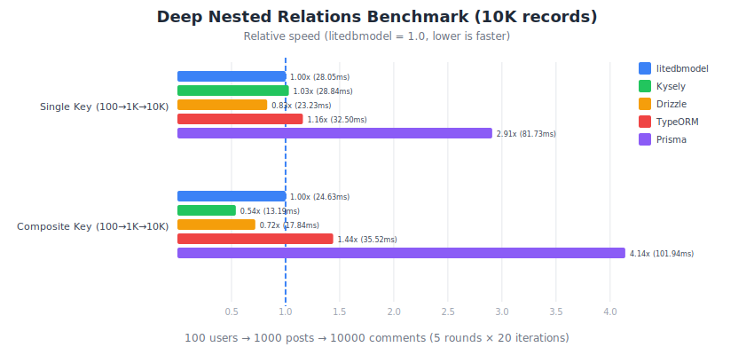

# Performance Benchmark

Benchmark comparing litedbmodel with Prisma, Kysely, Drizzle, and TypeORM on PostgreSQL.

Based on [Prisma's official orm-benchmarks](https://github.com/prisma/orm-benchmarks) methodology.  
Reference: [Kysely performance comparison article](https://izanami.dev/post/1e3fa298-252c-4f6e-8bcc-b225d53c95fb)

---

## Standard Operations Benchmark

**Test Environment:**
- PostgreSQL 16 (Docker, local - no network latency)
- Node.js v24
- **10 rounds × 100 iterations = 1,000 total per ORM**
- Interleaved execution to reduce environmental variance
- 1,000 users, 5,000 posts seed data
- Metrics: **Median** (primary), IQR, StdDev

### Visual Comparison


### Results Table (Median of 1,000 iterations)

| Operation | litedbmodel | Kysely | Drizzle | TypeORM | Prisma |
|-----------|-------------|--------|---------|---------|--------|
| Find all (limit 100) | **0.61ms** 🏆 | 0.83ms | 0.62ms | 0.86ms | 1.44ms |
| Filter, paginate & sort | **0.70ms** 🏆 | 0.83ms | 0.89ms | 1.18ms | 1.81ms |
| Nested find all | 4.74ms | **4.57ms** 🏆 | 5.13ms | 7.87ms | 12.52ms |
| Find first | 0.33ms | 0.29ms | **0.27ms** 🏆 | 0.30ms | 0.57ms |
| Nested find first | 0.56ms | 0.53ms | 0.59ms | **0.44ms** 🏆 | 0.92ms |
| Find unique (by email) | **0.26ms** 🏆 | **0.26ms** 🏆 | 0.29ms | 0.31ms | 0.48ms |
| Nested find unique | 0.57ms | **0.53ms** 🏆 | 0.59ms | 0.93ms | 0.87ms |
| Create | **0.28ms** 🏆 | **0.28ms** 🏆 | 0.30ms | 0.74ms | 0.45ms |
| Nested create | 0.55ms | **0.54ms** 🏆 | 0.57ms | 1.47ms | 1.51ms |
| Update | 0.28ms | **0.26ms** 🏆 | 0.27ms | 0.28ms | 0.53ms |
| Nested update | 0.58ms | **0.54ms** 🏆 | 0.56ms | 0.57ms | 1.98ms |
| Upsert | **0.27ms** 🏆 | 0.28ms | 0.29ms | 0.31ms | 1.58ms |
| Nested upsert | **0.52ms** 🏆 | 0.57ms | 0.61ms | 0.61ms | 1.85ms |
| Delete | **0.53ms** 🏆 | 0.55ms | 0.58ms | 1.03ms | 0.93ms |

### Analysis

1. **litedbmodel** - **Fastest in 7 operations** 🏆
   - **#1 in Find all, Filter/paginate/sort, Find unique, Create, Upsert, Nested upsert, Delete**
   - Competitive in all operations (within 10% of fastest)
   - Best for applications with complex queries, CRUD, and filtering

2. **Kysely** - **Fastest in 7 operations** 🏆
   - **#1 in Nested find all, Find unique, Nested find unique, Create, Nested create, Update, Nested update**
   - Minimal abstraction overhead
   - Best for write-heavy apps needing raw SQL control

3. **Drizzle** - Strong all-around performance
   - Fastest in Find first
   - Consistent performance across operations
   - Good balance of features and speed

4. **TypeORM** - Variable performance
   - Fastest in Nested find first (JOIN-based approach)
   - **Slow Create** (~2.6x slower than fastest)
   - Higher overhead for nested operations

5. **Prisma** - Convenience over speed
   - **Slowest in most operations** (1.6x - 5.9x slower)
   - Nested find all: 12.52ms vs Kysely's 4.57ms (2.7x slower)
   - Trade-off: Rich DX features (Prisma Studio, migrations, etc.)

---

## Deep Nested Relations Benchmark (10,000 records)

Separate benchmark for **large-scale nested relation queries**:
- **Single Key**: 100 users → 1000 posts → 10000 comments (3-level nesting)
- **Composite Key**: 100 tenant_users → 1000 tenant_posts → 10000 tenant_comments (3-level with composite FK)

**Test Environment:**
- Rounds: 5
- Iterations per round: 20
- **5 rounds × 20 iterations = 100 total per ORM**
- Database: PostgreSQL

### Visual Comparison



### Single Key Relations (100 → 1000 → 10000)

| ORM | Median | Ratio | Queries |
|-----|--------|-------|---------|
| Drizzle | 23.80ms | 1.00x | 1 |
| **litedbmodel** | **28.24ms** | **1.19x** | **3** |
| Kysely | 29.51ms | 1.24x | 3 |
| TypeORM | 32.70ms | 1.37x | 2 |
| Prisma | 81.65ms | 3.43x | 3 |

### Composite Key Relations (100 → 1000 → 10000)

| ORM | Median | Ratio | Queries |
|-----|--------|-------|---------|
| Kysely | 12.96ms | 1.00x | 3 |
| Drizzle | 17.50ms | 1.35x | 1 |
| **litedbmodel** | **24.69ms** | **1.90x** | **3** |
| TypeORM | 35.53ms | 2.74x | 2 |
| Prisma | 102.29ms | 7.89x | 3 |

### Deep Nested Analysis

- **Single Key:** Drizzle wins with LATERAL JOIN (24ms), litedbmodel close (28ms), Prisma slowest (82ms)
- **Composite Key:** Kysely wins (13ms), litedbmodel good (25ms), Prisma slowest (102ms)
- **litedbmodel advantage:** Readable SQL with fixed parameter count (ideal for log analysis)

---

## SQL Query Comparison

### litedbmodel's SQL Advantages

litedbmodel generates SQL with the following characteristics:

#### 1. Human-Readable SQL

```sql
-- litedbmodel: Simple and readable
SELECT * FROM benchmark_posts 
WHERE benchmark_posts.author_id = ANY($1::int[])

-- Prisma: Verbose with fully qualified names
SELECT "public"."benchmark_posts"."id", "public"."benchmark_posts"."title", 
       "public"."benchmark_posts"."content", "public"."benchmark_posts"."published", 
       "public"."benchmark_posts"."author_id", "public"."benchmark_posts"."created_at" 
FROM "public"."benchmark_posts" 
WHERE "public"."benchmark_posts"."author_id" IN ($1,$2,$3,...,$100)
```

#### 2. Fixed Parameter Count (PostgreSQL only)

> **Note:** `ANY()` and `unnest()` are PostgreSQL-specific features. On MySQL/SQLite, litedbmodel falls back to standard `IN (...)` syntax.

| Feature | litedbmodel | Prisma | Kysely | TypeORM |
|---------|-------------|--------|--------|---------|
| 100 records | **`$1`** | `$1`~`$100` | `$1`~`$100` | `$1`~`$100` |
| 1000 records | **`$1`** | `$1`~`$1000` | `$1`~`$1000` | `$1`~`$1000` |
| Parameter Style | `ANY($1::int[])` | `IN ($1,$2,...,$N)` | `IN ($1,$2,...,$N)` | `IN ($1,$2,...,$N)` |

**Benefits:**
- **Easier SQL log analysis** - Same query pattern regardless of data size
- **More stable SQL fingerprints** - Prepared statements more predictable in typical setups
- **Log readability** - Understand query intent without expanding parameters

#### 3. Query Log Example

```
# litedbmodel logs (fixed parameter count = same pattern)
SELECT * FROM benchmark_posts WHERE author_id = ANY($1::int[])
  Parameters: [{1,2,3,...,100}]

SELECT * FROM benchmark_posts WHERE author_id = ANY($1::int[])
  Parameters: [{101,102,...,200}]

# Prisma/Kysely logs (variable parameter count = different patterns)
SELECT ... WHERE author_id IN ($1,$2,...,$100)
  Parameters: [1,2,3,...,100]

SELECT ... WHERE author_id IN ($1,$2,...,$1000)
  Parameters: [1,2,3,...,1000]
```

---

## SQL Query Analysis (Full)

### Single Key Relations

#### litedbmodel

**Query Count:** 3 | **Parameters:** Fixed (1 per query)

```sql
-- Query 1: Users (no parameters)
SELECT * FROM benchmark_users ORDER BY id ASC LIMIT 100

-- Query 2: Posts (1 parameter = array)
SELECT * FROM benchmark_posts 
WHERE benchmark_posts.author_id = ANY($1::int[])

-- Query 3: Comments (1 parameter = array)
SELECT * FROM benchmark_comments 
WHERE benchmark_comments.post_id = ANY($1::int[])
```

#### Prisma

**Query Count:** 3 | **Parameters:** Variable (100 for 100 records, 1000 for 1000 records)

```sql
-- Query 1
SELECT "public"."benchmark_users"."id", "public"."benchmark_users"."email", ...
FROM "public"."benchmark_users" WHERE 1=1 
ORDER BY "public"."benchmark_users"."id" ASC LIMIT $1 OFFSET $2

-- Query 2 (100 parameters)
SELECT ... FROM "public"."benchmark_posts" 
WHERE "public"."benchmark_posts"."author_id" IN ($1,$2,$3,$4,$5,...,$100) OFFSET $101

-- Query 3 (1000 parameters)
SELECT ... FROM "public"."benchmark_comments" 
WHERE "public"."benchmark_comments"."post_id" IN ($1,$2,$3,...,$1000) OFFSET $1001
```

#### Kysely

**Query Count:** 3 | **Parameters:** Variable

```sql
-- Query 1
select * from "benchmark_users" order by "id" limit $1

-- Query 2 (100 parameters)
select * from "benchmark_posts" 
where "author_id" in ($1, $2, $3, ..., $100)

-- Query 3 (1000 parameters)
select * from "benchmark_comments" 
where "post_id" in ($1, $2, $3, ..., $1000)
```

#### Drizzle

**Query Count:** 1 | **Complex LATERAL JOIN**

```sql
select "users"."id", "users"."email", "users"."name", "users_posts"."data" as "posts" 
from "benchmark_users" "users" 
left join lateral (
  select coalesce(json_agg(json_build_array(
    "users_posts"."id", "users_posts"."title", "users_posts"."author_id", 
    "users_posts_comments"."data"
  )), '[]'::json) as "data" 
  from "benchmark_posts" "users_posts" 
  left join lateral (
    select coalesce(json_agg(json_build_array(
      "users_posts_comments"."id", "users_posts_comments"."body", 
      "users_posts_comments"."post_id"
    )), '[]'::json) as "data" 
    from "benchmark_comments" "users_posts_comments" 
    where "users_posts_comments"."post_id" = "users_posts"."id"
  ) "users_posts_comments" on true 
  where "users_posts"."author_id" = "users"."id"
) "users_posts" on true 
order by "users"."id" asc limit $1
```

#### TypeORM

**Query Count:** 2 | **Complex aliases (hash-based)**

```sql
-- Query 1: DISTINCT for pagination
SELECT DISTINCT "distinctAlias"."TypeORMUser_id" AS "ids_TypeORMUser_id" 
FROM (
  SELECT "TypeORMUser"."id" AS "TypeORMUser_id", 
         "TypeORMUser"."email" AS "TypeORMUser_email", ...
         "44e9b3e14e8c506ab5696ff82803c1017462faac"."id" AS "44e9b3e14e8c506ab5696ff82803c1017462faac_id"
  FROM "benchmark_users" "TypeORMUser" 
  LEFT JOIN "benchmark_posts" "TypeORMUser__TypeORMUser_posts" ON ...
  LEFT JOIN "benchmark_comments" "44e9b3e14e8c506ab5696ff82803c1017462faac" ON ...
) "distinctAlias" 
ORDER BY "TypeORMUser_id" ASC LIMIT 100

-- Query 2: Full data fetch with 100 IN values
SELECT ... FROM "benchmark_users" "TypeORMUser" 
LEFT JOIN ... LEFT JOIN ...
WHERE "TypeORMUser"."id" IN (1, 2, 3, ..., 100)
```

---

### Composite Key Relations

#### litedbmodel

**Query Count:** 3 | **Parameters:** Fixed (2 per query = 2 arrays)

```sql
-- Query 1
SELECT * FROM benchmark_tenant_users WHERE tenant_id = $1 LIMIT 100

-- Query 2 (unnest + JOIN)
SELECT * FROM benchmark_tenant_posts 
JOIN unnest($1::int[], $2::int[]) AS _keys(tenant_id, user_id)
ON benchmark_tenant_posts.tenant_id = _keys.tenant_id 
   AND benchmark_tenant_posts.user_id = _keys.user_id

-- Query 3 (unnest + JOIN)
SELECT * FROM benchmark_tenant_comments 
JOIN unnest($1::int[], $2::int[]) AS _keys(tenant_id, post_id)
ON benchmark_tenant_comments.tenant_id = _keys.tenant_id 
   AND benchmark_tenant_comments.post_id = _keys.post_id
```

#### Prisma

**Query Count:** 3 | **Parameters:** Variable (200 for 100 composite keys, 2000 for 1000 keys)

```sql
-- Query 2 (200 parameters for 100 composite keys)
SELECT ... FROM "public"."benchmark_tenant_posts" 
WHERE ("public"."benchmark_tenant_posts"."tenant_id","public"."benchmark_tenant_posts"."user_id") 
IN (($1,$2),($3,$4),($5,$6),...,($199,$200)) OFFSET $201

-- Query 3 (2000 parameters for 1000 composite keys)
SELECT ... FROM "public"."benchmark_tenant_comments" 
WHERE ("tenant_id","post_id") IN (($1,$2),($3,$4),...,($1999,$2000)) OFFSET $2001
```

#### Kysely

**Query Count:** 3 | **Parameters:** Variable (single key part only uses IN)

```sql
-- Query 2 (100 parameters - tenant_id is fixed)
select * from "benchmark_tenant_posts" 
where "tenant_id" = $1 and "user_id" in ($2, $3, ..., $101)

-- Query 3 (1000 parameters)
select * from "benchmark_tenant_comments" 
where "tenant_id" = $1 and "post_id" in ($2, $3, ..., $1001)
```

#### Drizzle

**Query Count:** 1 | **LATERAL JOIN with composite conditions**

```sql
select "tenantUsers"."tenant_id", "tenantUsers"."user_id", "tenantUsers"."name", 
       "tenantUsers_posts"."data" as "posts" 
from "benchmark_tenant_users" "tenantUsers" 
left join lateral (
  select coalesce(json_agg(json_build_array(...)), '[]'::json) as "data" 
  from "benchmark_tenant_posts" "tenantUsers_posts" 
  left join lateral (
    select coalesce(json_agg(...), '[]'::json) as "data" 
    from "benchmark_tenant_comments" ...
    where ("tenant_id" = "tenantUsers_posts"."tenant_id" 
           and "post_id" = "tenantUsers_posts"."post_id")
  ) ... on true 
  where ("tenant_id" = "tenantUsers"."tenant_id" 
         and "user_id" = "tenantUsers"."user_id")
) ... on true 
where "tenantUsers"."tenant_id" = $1 limit $2
```

#### TypeORM

**Query Count:** 2 | **Verbose OR chains**

```sql
-- Query 2: 100 OR conditions (200 parameters)
SELECT ... FROM "benchmark_tenant_users" ...
WHERE ( "tenant_id"=$1 AND "user_id"=$2 
     OR "tenant_id"=$3 AND "user_id"=$4 
     OR "tenant_id"=$5 AND "user_id"=$6 
     ... 
     OR "tenant_id"=$199 AND "user_id"=$200 )
```

---

## SQL Characteristics Summary

| Characteristic | litedbmodel | Kysely | Drizzle | TypeORM | Prisma |
|----------------|-------------|--------|---------|---------|--------|
| Readability | ⭐⭐⭐⭐⭐ | ⭐⭐⭐⭐ | ⭐⭐ | ⭐ | ⭐⭐ |
| IN/ANY Param Growth† | Fixed | Variable | N/A | Variable | Variable |
| Debuggability | ⭐⭐⭐⭐⭐ | ⭐⭐⭐⭐ | ⭐⭐ | ⭐ | ⭐⭐ |
| SQL Fingerprint Stability (PG)‡ | ⭐⭐⭐⭐⭐ | ⭐⭐⭐ | N/A | ⭐⭐ | ⭐⭐ |

*† "IN/ANY Param Growth" = whether parameter count grows with data size (e.g., `IN ($1,$2,...,$N)` vs `ANY($1::int[])`). Drizzle uses single-query JSON aggregation, so this axis doesn't apply.*  
*‡ Drizzle uses a fundamentally different approach (single large query with JSON aggregation); fingerprint stability is not directly comparable to batch-query ORMs.*

**Notes:**
- **litedbmodel**: `ANY($1::int[])` produces consistent SQL patterns, ideal for log analysis and monitoring
- **Kysely**: Simple SQL but variable parameter count (IN clause)
- **Drizzle**: Standard API uses single round-trip (LATERAL JOIN + JSON aggregation) but complex to debug
- **TypeORM**: Hash-based aliases make SQL difficult to read
- **Prisma**: Fully qualified names add verbosity

---

## Why Drizzle is Fastest (Single Key)

Drizzle's **standard relation API** uses PostgreSQL's `LATERAL JOIN` with `json_agg()` to fetch all nested data in a single DB round-trip:

> **Note:** This is Drizzle's idiomatic approach via `db.query.*.findMany({ with: {...} })`. Other ORMs can achieve similar results with manual SQL, but Drizzle provides this as a built-in pattern.

```sql
SELECT "users".*, "posts"."data" as "posts"
FROM "benchmark_users" "users"
LEFT JOIN LATERAL (
  SELECT json_agg(json_build_array("posts".*, "comments"."data")) as "data"
  FROM "benchmark_posts" "posts"
  LEFT JOIN LATERAL (
    SELECT json_agg(...) as "data"
    FROM "benchmark_comments" ...
  ) "comments" ON true
  WHERE "posts"."author_id" = "users"."id"
) "posts" ON true
```

**Trade-offs:**
- ✅ Single round-trip (fastest for network latency)
- ❌ Complex SQL (difficult to debug)
- ❌ Heavy DB-side JSON processing
- ❌ Result parsing overhead
- ❌ Query must be pre-defined with all relations upfront

---

## litedbmodel's Design Philosophy

### Transparent Lazy Loading

litedbmodel takes a fundamentally different approach: **relations are statically defined, but data is dynamically loaded only when accessed**.

```typescript
// Define relations once in your model
@model('users')
class UserModel extends DBModel {
  @column() id?: number;
  @column() name?: string;
  
  // Use 'declare' for relation properties
  @hasMany(() => [User.id, Post.author_id])
  declare posts: Promise<Post[]>;
}

// Same model works for both list and detail views
const users = await User.find([], { limit: 100 });

// List view: Only access user data
for (const user of users) {
  console.log(user.name);  // No additional queries
}

// Detail view: Access relations when needed
for (const user of users) {
  const posts = await user.posts;  // Batch loads all posts for 100 users in ONE query
  for (const post of posts) {
    const comments = await post.comments;  // Batch loads comments in ONE query
  }
}
```

**Key Advantages:**

| Aspect | Drizzle (Eager) | litedbmodel (Lazy) |
|--------|-----------------|-------------------|
| Query definition | Must specify all relations upfront | Relations loaded on-demand |
| List view efficiency | Fetches unused nested data | Only fetches what's accessed |
| Detail view support | ⚠️ Usually needs separate queries | ✅ Same model works |
| Code reusability | Different queries for different views | One model, multiple use cases |
| N+1 prevention | ⚠️ If using `{ with: ... }` | ✅ Automatic batch loading |

**Real-World Scenario:**

```typescript
// API endpoint that serves both list and detail
async function getUsers(includeDetails: boolean) {
  const users = await User.find([], { limit: 100 });
  
  if (includeDetails) {
    // First access triggers batch loading for ALL users
    // Subsequent accesses return from cache
    for (const user of users) {
      await user.posts;  // 1st: batch query, rest: cache
    }
  }
  
  return users;
}
```

With Drizzle's approach, you'd need two different queries:
- `db.query.users.findMany()` for list view
- `db.query.users.findMany({ with: { posts: true } })` for detail view

With litedbmodel, the same code handles both cases - relations are loaded only when accessed, and always batch-loaded to prevent N+1.

---

### Batch Loading Strategy

```
1. Load users           → SELECT * FROM users LIMIT 100
2. Batch load posts     → SELECT * FROM posts WHERE author_id = ANY($1)
3. Batch load comments  → SELECT * FROM comments WHERE post_id = ANY($1)
```

**Advantages (PostgreSQL):**
- **Simple SQL** - Each query is independently understandable
- **Fixed parameter count (PG)** - `ANY($1::int[])` keeps param count stable, ideal for log analysis
- **Stable SQL fingerprints (PG)** - Consistent patterns for prepared statements
- **Transparent debugging** - Easy to identify issues

### Composite Key with unnest + JOIN

```sql
SELECT * FROM posts
JOIN unnest($1::int[], $2::int[]) AS _keys(tenant_id, user_id)
ON posts.tenant_id = _keys.tenant_id AND posts.user_id = _keys.user_id
```

**vs IN with tuples:**
```sql
-- Prisma/TypeORM style (2000 parameters for 1000 keys)
WHERE (tenant_id, user_id) IN (($1,$2),($3,$4),...,($1999,$2000))
```

**Advantages of unnest:**
- Parameter count is always 2 (independent of key count)
- PostgreSQL's efficient array handling
- Consistent query pattern trackable in SQL logs

---

## Conclusion

| Scenario | Best Fit | Notes |
|----------|----------|-------|
| Standard CRUD operations | **litedbmodel** | Fastest in Find all, Filter/sort, Create, Upsert, Delete |
| Single Key nested (raw speed) | Drizzle | 1 query via LATERAL JOIN + JSON |
| Single Key nested (SQL quality) | **litedbmodel** | Readable + debuggable; stable query patterns (PG) |
| Composite Key (speed) | Kysely | Manual batching (tenant fixed; simple IN effective) |
| Composite Key (SQL quality) | **litedbmodel** | Readable + debuggable; stable patterns (PG) |
| Log Analysis / Monitoring | **litedbmodel** | Consistent query patterns |
| SQL Fingerprint Stability (PG) | **litedbmodel** | Most predictable in prepared-statement setups |
| Code Maintainability | **litedbmodel** | Transparent lazy loading |

**litedbmodel excels at:**
- **Complex filtering with pagination**
- **CRUD operations** (Create, Upsert, Delete)
- **Unique lookups**
- **Consistent performance** across all operations

**vs Prisma:** litedbmodel is **1.6x - 5.9x faster** across all operations  
**vs Query Builders:** litedbmodel is competitive (within 10%), with better DX

> **litedbmodel provides best-in-class performance while offering:**
> - Type-safe column symbols (IDE refactoring)
> - SKIP declarative pattern for partial updates
> - Automatic N+1 prevention without explicit includes
> - Middleware support for cross-cutting concerns
> - Active Record pattern simplicity

---

*Last updated: January 2026*  
*Benchmark methodology: Based on [Prisma orm-benchmarks](https://github.com/prisma/orm-benchmarks)*

